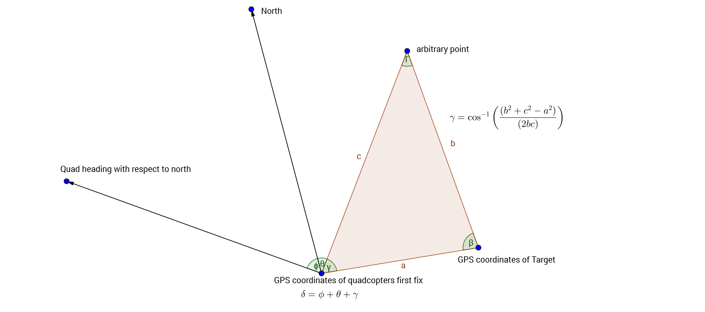
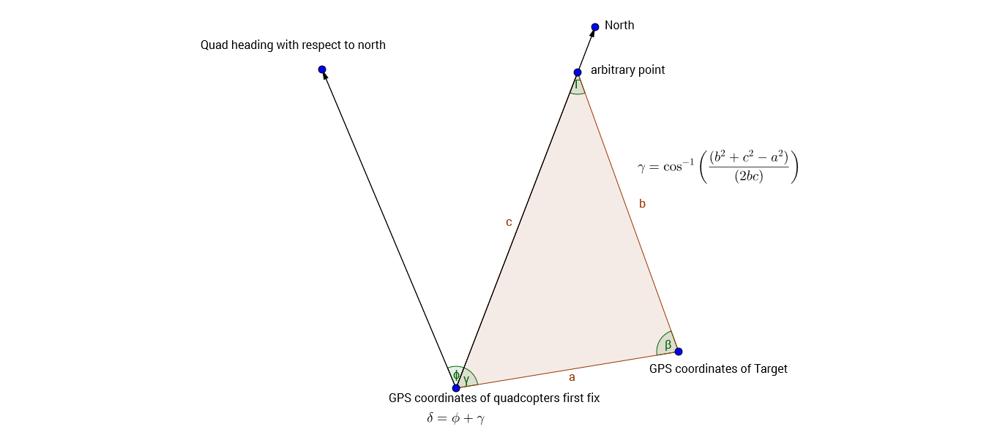

The current status of the WCC quadcopter project intended for entry in the 2016 ARLISS competition.
Our current standing is that we have an assembled quadcopter which has jumped out of my hands with great enthusiasm but still
requires a fair amount of tweeking before it will be ready for flight. 

All files currently associated with this project; including navigation program, flight test program, and budget/flight analysis can be found on github at the following link. https://github.com/dhaead/Arliss_2016

The current status can be summed up in terms of addressing each facet of the project. Within each facet we will discuss the 
scope and level of completion, as well as the most current plan for completing the remaining work to achieve our goal of an 
autonomous quadcopter navigation to a target after sustaining a rocket launch and subsequent ejection from a height of approximately 2 miles.

The areas of this project currently being discussed are:
The airframe (frame,motors,esc's,power distribution,micro controller,batteries)
The navigation system (micro controller, IMU, GPS, navigation algorithm, data aquistion, data processing)

Initial proof of concept flight tests for the airframe have been so far unsuccessful. Due to a malfunction with our main micro controller (Adafruit feather M0 basic proto)
it was necessary to utilize a different microcontroller which happened to be on hand to do testing with the airframe. Our current airframe electronics package is
the arduino atmega 2560 which signals the ESC's to turn on the motors. We are using a 1.3 A 30C lipo battery 11.1 V. I have implemented an 11 second test flight
program which immediatly arms the ESC's then waits 7 seconds and goes to full throttle for 2 seconds then throttles down to 3/4 throttle for 2 seconds then shuts off. 
I can see that the quad is trying to lift but it's not quite getting there. I believe that our quad is too heavy.
I am trying to find ways to lighten our load however I think the current frame that we have is too heavy. We either need a store bought frame or a 3-D printed frame
which will be lighter than the bass wood frame I put together. There may be other factors which affect the quads ability to lift and I will be looking in to those 
as well. 

We made some progress as far as our navigation system is concerned. I have wired up the IMU and the GPS to the Adafruit feather M0 basic proto microcontroller,
and began doing distance calculations and developing and implementing the algorithm that will be used to navigate to the target. The start of the mission will 
be triggered by a photocell which will activate upon exit from the rocket. The algorithm to be implemented and tested will utilize the law of cosines and prior
knowledge of the test area to simplify the math. The idea will be to take a gps fix of the quads initial position after ejection from the rocket. This fix combined
with the coordinates of our target as well as an arbitrary third set of coordinates will give us the triangle we need to calculate the distances between all three 
of these points. 

 

Since our choice for the third point is arbitrary and we have an onboard compass, we should pick a point known to be north of the approximate ejection
region(the estimated flight corridor of the rocket). Because we can calculate our angle off of north using the onboard compass, and if we know the distances between the
three gps coordinate pairs and we choose our third point to be north, we can use the law of cosines to determine the angle between north and our target. This added to
the angle between our body axis and north, will give us the angle the quad must rotate in order to be heading toward the target. In the figure this is the angle \delta.

Overall our current status is that we have an operational if not flight capable airframe. The navigation package has been prototyped and tested and is in working order, with the exception of the failure of our current microcontroller due to unknown reasons. There are a few parts that we still need to complete our project, and there are a few parts that we should have spares of. The list and quantities are below, as well as links to each.

Adafruit feather M0 adalogger 
we need at least one. I would like to have one or two extra.

Linear Technologies 3.3 volt regulator.
we should order 5.

30C 1300 mah 11.1 volt lipo batteries
we acuire 2.
